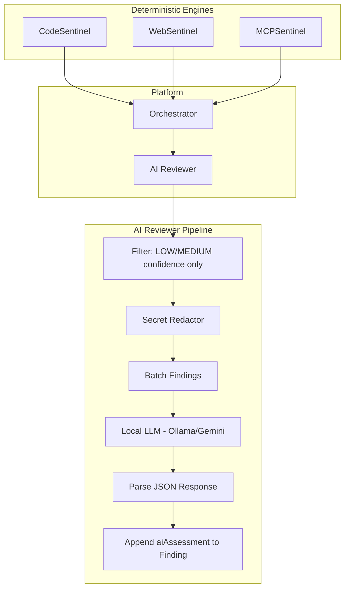

# AI Assist — Overview

Sentinel's AI Assist module augments the deterministic engines with **local LLM intelligence**. It is designed with a strict philosophy: the deterministic AST/DOM/Schema analysis is always the source of truth, and AI only enhances — never overrides — those findings.

## Core Philosophy

::: tip DETERMINISTIC > AI
AI **MUST NOT** silently mutate deterministic findings. The original finding generated by the static/dynamic engines is the immutable source of truth. The AI's evaluation is entirely confined to the `aiAssessment` property appended to the finding.
:::

## Architecture



## What AI Does in Sentinel

| Capability | Description | Trigger |
| --- | --- | --- |
| **Finding Triage** | Evaluates if a finding is a true positive or false positive | Automatic for LOW/MEDIUM confidence findings |
| **1-Click Patch Generation** | Outputs a unified git `.patch` diff to fix the vulnerability | Part of AI response schema |
| **Exploit PoC Generation** | Generates executable `curl` or Python scripts to prove the exploit | Part of AI response schema |
| **Intelligent Fuzzing** | Dynamically generates adversarial prompt-injection payloads for AI widgets | Triggered by WebSentinel's AI widget rule |
| **Business Logic Auditing** | Deep semantic analysis of complex route handlers for race conditions | Triggered by CodeSentinel's business-logic-ai rule |
| **Executive Report** | LLM-generated VC-grade summary of the full scan results | Triggered by `--executive-report` CLI flag |

## Supported AI Providers

| Provider | Type | Privacy | Status |
| --- | --- | --- | --- |
| **Ollama (llama3)** | Local | ✅ 100% local, zero data exfiltration | ✅ Production |
| **Gemini (gemini-2.5-flash)** | Cloud | ⚠️ Requires API key, data sent to Google | ✅ Production |

## The `aiAssessment` Schema

When the AI evaluates a finding, it appends a structured assessment:

```typescript
interface AiAssessment {
  verdict: 'confirmed' | 'likely' | 'uncertain' | 'dismissed';
  confidence: number;    // 0.0 to 1.0
  reason: string;        // Human-readable explanation
  impact?: string;       // Business impact assessment
  remediation?: string;  // How to fix it
  additionalEvidenceNeeded?: string[];
  patch?: string;        // Unified git diff (.patch format)
  poc?: string;          // Executable curl/python exploit script
}
```

## Security Guarantees

1. **Secret Redaction:** Before any finding is sent to the LLM, the `SecretRedactor` strips all hardcoded secrets, API keys, tokens, and passwords from the evidence payload. The LLM never sees real secrets.
2. **Budget Enforcement:** A strict token budget (default: 5 requests per scan) prevents runaway LLM costs. Once the budget is exhausted, remaining findings skip AI evaluation.
3. **Local-First:** Ollama runs entirely on your machine. No data leaves your network.
