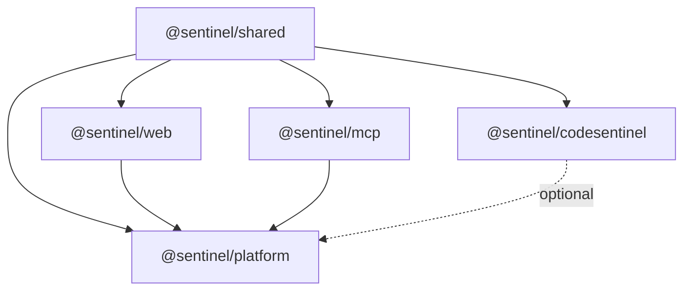

# Repository Structure

Sentinel is organized as a TypeScript monorepo using npm workspaces.

## Directory Layout

```
ApTes/
├── packages/
│   ├── shared/                  # @sentinel/shared — Universal types
│   │   ├── src/
│   │   │   ├── finding.ts       # Finding, Severity, Confidence, AiAssessment
│   │   │   ├── index.ts         # Public API exports
│   │   │   └── index.test.ts    # 16 unit tests
│   │   ├── package.json
│   │   └── tsconfig.json
│   │
│   ├── codesentinel/            # @sentinel/codesentinel — Static AST engine
│   │   ├── src/
│   │   │   ├── scanner.ts       # Main scan pipeline (walk → parse → analyze)
│   │   │   ├── walker.ts        # File system walker with .gitignore support
│   │   │   ├── parser.ts        # Multi-language parser router (ts-morph + tree-sitter)
│   │   │   ├── parser/
│   │   │   │   └── python.ts    # Python AST parser via tree-sitter
│   │   │   ├── cache.ts         # SHA-256 incremental scan cache
│   │   │   ├── config.ts        # CodeSentinel configuration
│   │   │   ├── cli.ts           # Standalone CLI
│   │   │   └── rules/
│   │   │       ├── rule.ts      # CodeRule interface definition
│   │   │       ├── engine.ts    # Rule execution engine
│   │   │       ├── data-flow.ts # Cross-file taint tracking algorithm
│   │   │       └── detectors/
│   │   │           ├── injection.ts          # SQL/NoSQL/Command injection
│   │   │           ├── python-injection.ts   # Python eval()/exec() detection
│   │   │           ├── hardcoded-secrets.ts   # Secret detection
│   │   │           ├── logic-contradictions.ts # Always-true/false logic
│   │   │           ├── missing-auth.ts        # Missing route middleware
│   │   │           ├── unreachable-code.ts    # Dead code detection
│   │   │           ├── unhandled-promise.ts   # Floating promises
│   │   │           ├── type-errors.ts         # TypeScript diagnostics
│   │   │           ├── idor-risk.ts           # Insecure Direct Object Refs
│   │   │           ├── api-integration.ts     # Missing fetch() error handling
│   │   │           ├── contract-mismatch.ts   # Frontend↔Backend route mismatch
│   │   │           ├── payload-mismatch.ts    # Request/response schema mismatch
│   │   │           ├── mcp-exposure.ts        # MCP client exposure in routes
│   │   │           ├── config-drift.ts        # docker-compose vs .env drift
│   │   │           ├── business-logic-ai.ts   # Complex logic → AI review
│   │   │           └── rules.test.ts          # 32 unit tests
│   │   ├── fixtures/
│   │   │   ├── sample-project/  # Vulnerable test project
│   │   │   ├── vulnerable/      # Isolated vulnerability fixtures
│   │   │   └── safe/            # Clean code fixtures (zero findings)
│   │   └── package.json
│   │
│   ├── web/                     # @sentinel/web — Dynamic DOM engine
│   │   ├── src/
│   │   │   ├── runner.ts        # Playwright browser orchestrator
│   │   │   ├── security.ts      # SSRF protection module
│   │   │   ├── cli.ts           # Standalone CLI
│   │   │   └── rules/
│   │   │       ├── rule.ts      # WebRule interface
│   │   │       ├── headers.ts   # Security headers check
│   │   │       ├── cookies.ts   # Cookie attribute check
│   │   │       ├── ai-widget.ts # AI chat widget fuzzer + LLM payloads
│   │   │       └── console.ts   # Console error capture
│   │   └── package.json
│   │
│   ├── mcp/                     # @sentinel/mcp — AI Agent audit engine
│   │   ├── src/
│   │   │   ├── runner.ts        # MCP client + stdio transport
│   │   │   ├── cli.ts           # Standalone CLI
│   │   │   └── rules/
│   │   │       └── privilege-analysis.ts  # Tool privilege classification
│   │   └── package.json
│   │
│   ├── platform/                # @sentinel/platform — Orchestrator + CLI
│   │   ├── src/
│   │   │   ├── cli.ts           # Commander.js CLI entry point
│   │   │   ├── wizard.ts        # @clack/prompts interactive wizard
│   │   │   ├── auto-detect.ts   # Heuristic workspace analyzer
│   │   │   ├── orchestrator.ts  # Tri-boundary scan coordinator
│   │   │   ├── ai-reviewer.ts   # AI triage pipeline
│   │   │   ├── redactor.ts      # Secret redactor for AI payloads
│   │   │   ├── ai/
│   │   │   │   ├── provider.ts       # AIProvider interface
│   │   │   │   ├── ollama-provider.ts # Local Ollama LLM
│   │   │   │   ├── gemini-provider.ts # Google Gemini API
│   │   │   │   └── cache.ts          # AI response cache
│   │   │   └── reporters/
│   │   │       ├── cli.ts       # Terminal color reporter
│   │   │       ├── json.ts      # JSON export
│   │   │       ├── html.ts      # HTML dashboard
│   │   │       ├── markdown.ts  # Markdown (CI/CD)
│   │   │       └── executive.ts # AI executive HTML report
│   │   ├── templates/
│   │   │   └── sentinel-action.yml  # GitHub Action template
│   │   └── package.json
│   │
│   └── docs/                    # VitePress documentation website
│       ├── .vitepress/config.mts
│       ├── index.md             # Homepage
│       ├── getting-started/     # Installation, quick start, FAQ
│       ├── architecture/        # System design, data flow
│       ├── engines/             # CodeSentinel, WebSentinel, MCPSentinel
│       ├── platform/            # Orchestrator, correlation, reporting
│       ├── ai-assist/           # Ollama, Gemini, redaction, budgets
│       ├── security/            # SSRF, MCP isolation, threat model
│       ├── cli-reference/       # Commands, flags, examples
│       ├── vision/              # VC pitch (problem, solution, value)
│       └── research/            # Academic methodology, algorithms
│
├── package.json                 # Root monorepo config
├── vitest.config.ts             # Test runner configuration
├── tsconfig.base.json           # Shared TypeScript config
└── README.md                    # Project README
```

## Package Dependencies



All packages depend on `@sentinel/shared` for the universal `Finding` interface. The Platform depends on Web and MCP engines. CodeSentinel is invoked directly by the Platform's orchestrator using its scan function.

## Key Technologies

| Technology | Purpose | Package |
| --- | --- | --- |
| `ts-morph` | TypeScript/JavaScript AST parsing | `@sentinel/codesentinel` |
| `tree-sitter` | Python AST parsing | `@sentinel/codesentinel` |
| `Playwright` | Headless browser automation | `@sentinel/web` |
| `@modelcontextprotocol/sdk` | MCP client connection | `@sentinel/mcp` |
| `Commander.js` | CLI argument parsing | `@sentinel/platform` |
| `@clack/prompts` | Interactive terminal wizard | `@sentinel/platform` |
| `picocolors` | Terminal color output | `@sentinel/platform` |
| `@google/genai` | Gemini API integration | `@sentinel/platform` |
| `VitePress` | Documentation website | `packages/docs` |
| `Vitest` | Unit & integration testing | Root |
