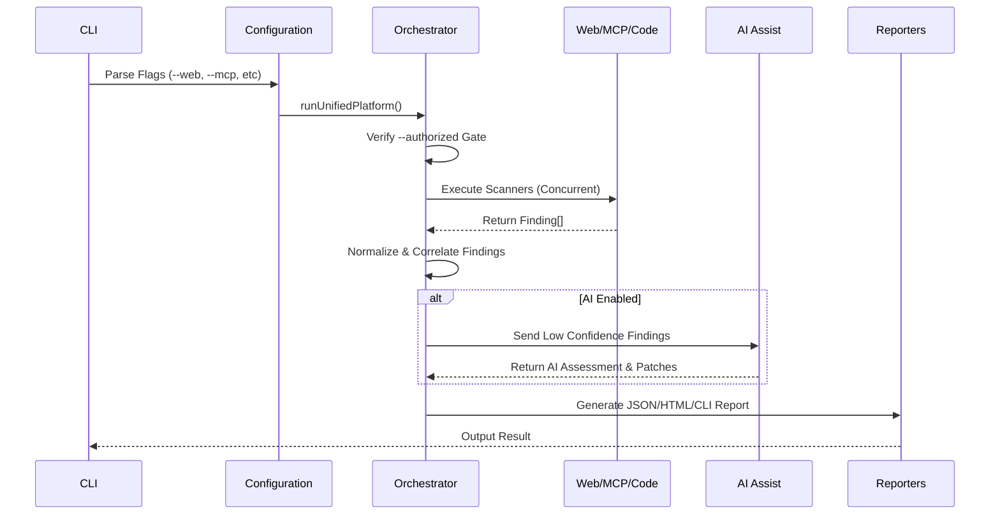

# Scan Lifecycle

The `Platform Orchestrator` manages a strict pipeline when executing a unified scan.

## Steps

1. **Gate Verification:** The scan immediately terminates if `--authorized` is not passed.
2. **Target Validation:** SSRF checks are applied to URLs.
3. **Concurrent Execution:** Engines run in parallel using `Promise.all()`.
4. **Correlation:** The orchestrator looks for matching conditions across outputs (e.g. `platform-mcp-exposure`).
5. **Reporting:** Findings are dumped to the selected reporters.
