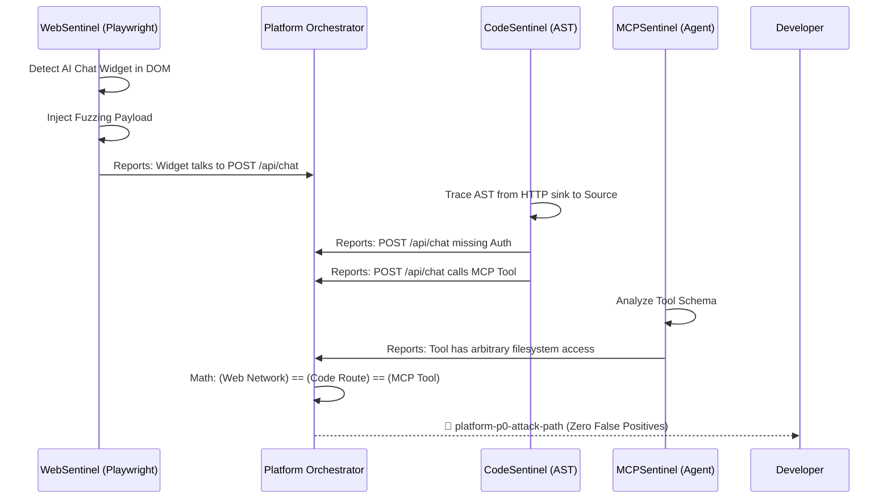

# System Overview

Sentinel is designed as a modular security platform consisting of three independent engines coordinated by a central orchestrator.

## High-Level Architecture

```mermaid
flowchart TD
    CLI[Sentinel CLI] --> Platform[Platform Orchestrator]
    
    subgraph Engines
        Platform --> CodeSentinel[CodeSentinel (AST)]
        Platform --> WebSentinel[WebSentinel (DOM)]
        Platform --> MCPSentinel[MCPSentinel (Schema)]
    end
    
    CodeSentinel --> Shared[Shared Finding Model]
    WebSentinel --> Shared
    MCPSentinel --> Shared
    
    Platform --> Correlation[Correlation Engine]
    Correlation --> AI[AI Assist (Ollama)]
    AI --> Reporter[Reporters (JSON/HTML/CLI)]
```

### Core Components

1. **The Orchestrator (`@sentinel/platform`)**
   The single entry point that manages the scan lifecycle, initializes engines concurrently, and aggregates results.

2. **The Engines (`@sentinel/web`, `@sentinel/codesentinel`, `@sentinel/mcp`)**
   Independent vulnerability scanners that operate on distinct domains. They share no internal state and output a unified `Finding[]` array.

3. **Shared Core (`@sentinel/shared`)**
   Contains the single source of truth for the `Finding` interface and shared enumeration types (e.g., Severity, Confidence).

4. **AI Assist (`@sentinel/platform/ai`)**
   An optional layer that intercepts low-confidence findings and passes them to a local LLM (Ollama) for validation, completely separate from deterministic logic.

## Zero False Positives: Exact Path Correlation

The true power of Sentinel is its ability to mathematically prove an attack path by correlating data across engines. Instead of throwing isolated alerts, the Orchestrator synthesizes them into a single, high-confidence P0 alert.


