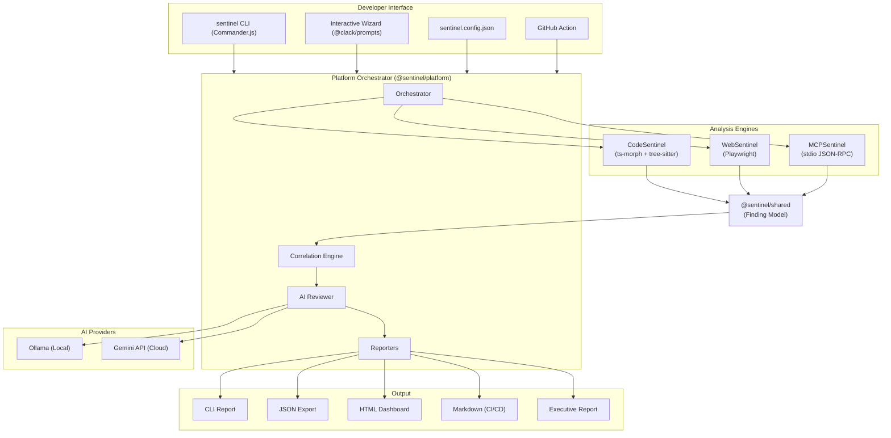
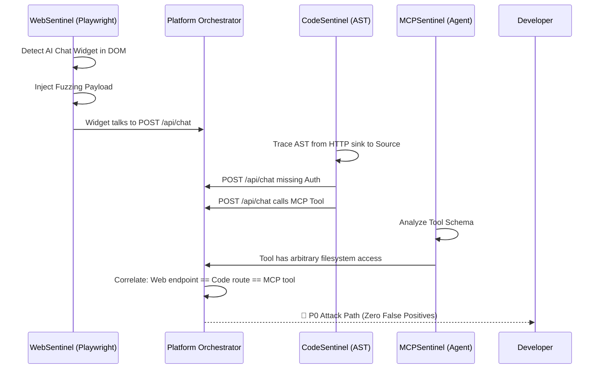

# System Overview

Sentinel is designed as a modular security platform consisting of three independent engines coordinated by a central orchestrator, with optional AI augmentation.

## High-Level Architecture

## Core Components

### 1. The Orchestrator (`@sentinel/platform`)
The single entry point that manages the entire scan lifecycle. It:
- Parses CLI arguments or config files.
- Launches all three engines concurrently using `Promise.allSettled()`.
- Aggregates `Finding[]` arrays from each engine into a unified report.
- Runs the Correlation Engine to synthesize P0 attack paths.
- Passes low-confidence findings to the AI Reviewer.
- Generates reports in multiple formats.

### 2. The Engines
Three independent vulnerability scanners that operate on distinct domains:

| Engine | Domain | Technology | Input | Output |
| --- | --- | --- | --- | --- |
| **CodeSentinel** | Source Code (AST) | `ts-morph`, `tree-sitter` | Directory path | `Finding[]` |
| **WebSentinel** | Live Web App (DOM) | `Playwright` | URL | `Finding[]` |
| **MCPSentinel** | AI Tool Server | `@modelcontextprotocol/sdk` | Command | `Finding[]` |

They share no internal state. Each engine outputs a standard `Finding[]` array defined in `@sentinel/shared`.

### 3. Shared Core (`@sentinel/shared`)
The single source of truth for:
- `Finding` interface (the universal vulnerability record)
- `Severity` enum (`CRITICAL`, `HIGH`, `MEDIUM`, `LOW`, `INFO`)
- `Confidence` enum (`HIGH`, `MEDIUM`, `LOW`)
- `AiAssessment` interface (AI triage results)
- `UnifiedReport` interface (scan results container)

### 4. AI Assist (`@sentinel/platform/ai`)
An optional layer that intercepts low-confidence findings and passes them to Ollama (local) or Gemini (cloud) for:
- Verdict assessment (confirmed/dismissed)
- 1-click patch generation
- Exploit PoC generation
- Executive summary generation

---

## Zero False Positives: Exact Path Correlation

The true power of Sentinel is its ability to **mathematically prove** an attack path by correlating data across all three engines.

### Why This Is Revolutionary

Traditional scanners operate in isolation. A SAST tool might flag "missing auth" with 50% confidence. A DAST tool might find an exposed endpoint. But neither can prove the full attack chain. Sentinel can, because it correlates all three boundaries simultaneously:

| Boundary | Finding | Standalone Confidence | Correlated Confidence |
| --- | --- | --- | --- |
| Web | AI widget sends to `/api/chat` | MEDIUM | — |
| Code | `/api/chat` has no auth middleware | HIGH | — |
| MCP | Tool has filesystem delete capability | HIGH | — |
| **Correlated** | **Full attack path: Widget → Unauthed Route → Destructive Tool** | — | **CRITICAL (P0)** |
