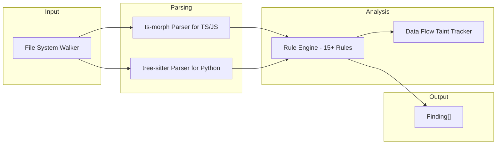

# CodeSentinel — Static Analysis Engine

CodeSentinel is the deterministic static analysis engine of the Sentinel platform. It parses TypeScript, JavaScript, and Python codebases into Abstract Syntax Trees (ASTs) to identify security vulnerabilities, logic flaws, and configuration drift — **without executing a single line of your code**.

## How It Works



### Step-by-Step Scan Pipeline

1. **File Discovery (`walker.ts`):** Recursively traverses the target directory. Automatically excludes `node_modules`, `dist`, `.git`, `build`, `.next`, `.cache`. Respects `.gitignore` patterns. Enforces hard limits: max 5,000 files, max 1 MB per file.
2. **AST Parsing (`parser.ts`):** Routes `.ts` and `.js` files to `ts-morph` (TypeScript Compiler API). Routes `.py` files to `tree-sitter` (Python grammar). Both produce full ASTs with type information.
3. **Incremental Caching (`cache.ts`):** Computes SHA-256 content hashes per file. If a file hasn't changed since the last scan, its findings are loaded from cache instead of re-analyzing. This makes CI/CD re-scans near-instant.
4. **Rule Execution (`engine.ts`):** Iterates all registered `CodeRule` implementations over every parsed source file. Each rule receives a `CodeRuleContext` containing the AST node, the full project, and the global `ParseResult`.
5. **Data-Flow Taint Tracking (`data-flow.ts`):** Rules can invoke the taint tracker to perform backwards AST traversal from a sink to a source across function boundaries and file boundaries.

---

## Supported Languages

| Language | Parser | Extensions | Status |
| --- | --- | --- | --- |
| TypeScript | `ts-morph` (TypeScript Compiler API) | `.ts`, `.tsx` | ✅ Full Support |
| JavaScript | `ts-morph` with `allowJs` | `.js`, `.jsx` | ✅ Full Support |
| Python | `tree-sitter` + `tree-sitter-python` | `.py` | ✅ Full Support |

---

## Structural Data-Flow Taint Tracking

Unlike simple regex matching (like `grep` or Semgrep), CodeSentinel uses advanced **backwards AST traversal** to mathematically trace data flow from sensitive "sinks" back to user-controllable "sources."

### Algorithm Deep-Dive

1. **Sink Identification:** Each rule defines sensitive sinks (e.g., `db.execute()`, `spawn()`, `User.findOne()`). When a sink is found in the AST, CodeSentinel identifies the arguments passed to it.
2. **Backwards AST Propagation:** The engine recursively traverses `Identifier` assignments backwards. If a variable traces to a `VariableDeclaration`, it recursively inspects its initializer expression.
3. **Cross-Function Parameter Tracing:** If a variable traces back to a function parameter (e.g., `function handleRequest(req)`), the engine finds **all call sites** of that function (its `CallExpression` nodes) and inspects the argument passed at that parameter index.
4. **Cross-File Tracing (ES6 Imports):** For `import { x } from './y'`, CodeSentinel maps the `ImportSpecifier` to its exported definition in the target file using the `ts-morph` Language Service and continues backwards traversal seamlessly.
5. **Cross-File Tracing (CommonJS `require`):** For `const x = require('./y')`, CodeSentinel manually resolves the module path, locates the target file in the AST project, and analyzes `module.exports` assignments.
6. **Taint Source Detection:** The recursive traversal terminates when it encounters a known Taint Source:
   - `req.body`, `req.query`, `req.params` (Express.js)
   - `event.queryStringParameters` (AWS Lambda)
   - `process.env` (Environment variables)
   - Function parameters named `input`, `data`, `payload`

### Example: Cross-File NoSQL Injection Detection
```
// File: routes/user.js
const { findUser } = require('../helpers/db');
router.get('/user', (req, res) => {
  const user = findUser(req.body);  // ← Taint source
  res.json(user);
});

// File: helpers/db.js
module.exports.findUser = (filter) => {
  return User.findOne(filter);  // ← Sink: Direct Object Injection!
};
```
CodeSentinel traces `req.body` → function arg → `filter` parameter → `User.findOne(filter)` across two files and correctly flags this as a **NoSQL Object Injection**.

---

## Complete Rule Reference

### 1. TypeScript Type Errors (`ts-type-error`)
- **Purpose:** Surfaces TypeScript compiler diagnostics as security-relevant findings.
- **How:** Reads `ts.DiagnosticCategory.Error` from the `ts-morph` project's pre-emit diagnostics.
- **Severity:** HIGH
- **Confidence:** HIGH

### 2. Hardcoded Secrets (`hardcoded-secret`)
- **Purpose:** Detects API keys, passwords, and tokens hardcoded in source code.
- **How:** Regex matching on variable names (`password`, `secret`, `api_key`, `token`) combined with string literal value analysis. Ignores empty strings, placeholders, and `process.env` references.
- **Severity:** CRITICAL
- **Confidence:** HIGH

### 3. Injection Risk (`injection-risk`)
- **Purpose:** Detects SQL injection, NoSQL injection, and command injection.
- **How:** Uses **Structural Data-Flow Taint Tracking** to prove that user input (`req.body`) reaches a dangerous sink (`db.execute`, `User.findOne`, `exec`).
- **Sub-types:**
  - **SQL Injection:** Unparameterized string concatenation in `db.query()` or `db.execute()`.
  - **NoSQL Injection:** Direct Object Injection where `req.body` is passed into Mongoose `findOne()`.
  - **Command Injection:** Unsanitized input reaching `child_process.exec()` or `child_process.spawn()`.
- **Severity:** CRITICAL (Command) / HIGH (SQL/NoSQL)
- **Confidence:** HIGH

### 4. Python Injection (`python-injection`)
- **Purpose:** Detects dangerous uses of `eval()` and `exec()` in Python.
- **How:** Uses `tree-sitter` to parse Python ASTs and identify `call_expression` nodes targeting `eval` or `exec` with non-literal arguments.
- **Severity:** CRITICAL
- **Confidence:** HIGH

### 5. Python Mass Assignment (`python-mass-assignment`)
- **Purpose:** Detects raw request dictionary unpacking (e.g. `User(**request.json())`) into database models.
- **How:** Identifies `dictionary_splat` (`**`) syntax applied to request payloads in model instantiations.
- **Severity:** HIGH
- **Confidence:** HIGH

### 6. Python SQL Injection (`python-sqli`)
- **Purpose:** Detects f-string and `%` string interpolation in database query execution (e.g. `cursor.execute(f"SELECT... {user_id}")`).
- **How:** Traces SQL query execution calls and verifies whether the query string utilizes unsafe string interpolation.
- **Severity:** CRITICAL
- **Confidence:** HIGH

### 7. Python SSRF (`python-ssrf`)
- **Purpose:** Detects HTTP requests via `requests.get()` or `httpx.get()` using unvalidated user input URLs.
- **How:** Checks HTTP client invocations for dynamic user-controlled destination parameters.
- **Severity:** HIGH
- **Confidence:** HIGH

### 8. Python Insecure JWT (`python-insecure-jwt`)
- **Purpose:** Detects JWT verification bypasses (`verify_signature: False` or algorithm `none`).
- **How:** Analyzes `jwt.decode()` calls for disabled signature verification options.
- **Severity:** CRITICAL
- **Confidence:** HIGH

### 9. Python IDOR (`python-idor`)
- **Purpose:** Detects database lookups by raw path IDs without tenant or user ownership validation.
- **How:** Inspects `Model.objects.get(id=...)` queries derived from path parameters.
- **Severity:** HIGH
- **Confidence:** LOW

### 5. Logic Contradictions (`logic-contradictions`)
- **Purpose:** Detects always-true, always-false, or contradictory conditions.
- **How:** AST analysis of `IfStatement` conditions. Detects patterns like `if (true)`, `if (x && !x)`, numeric comparisons that are logically impossible.
- **Severity:** HIGH
- **Confidence:** MEDIUM

### 6. Missing Authentication (`missing-auth`)
- **Purpose:** Flags sensitive Express.js routes that lack middleware.
- **How:** Inspects `app.get()`, `app.post()`, `router.get()` etc. for routes containing `/admin`, `/user`, `/account`, `/settings`. Checks if the route handler has middleware arguments before the final callback.
- **Severity:** HIGH
- **Confidence:** HIGH

### 7. Unreachable Code (`unreachable-code`)
- **Purpose:** Detects dead code after `return`, `throw`, `break`, or `continue` statements.
- **How:** Inspects `Block` children after terminal statements.
- **Severity:** LOW
- **Confidence:** HIGH

### 8. Unhandled Promises (`unhandled-promise`)
- **Purpose:** Detects floating promises that are not `await`-ed, returned, or `.catch()`-ed.
- **How:** Inspects `CallExpression` nodes whose return type is `Promise<T>` and checks parent context.
- **Severity:** MEDIUM
- **Confidence:** MEDIUM

### 9. IDOR Risk (`idor-risk`)
- **Purpose:** Detects Insecure Direct Object References in route handlers.
- **How:** Checks if database queries use `req.params.id` without correlating against `req.user.id` or session data.
- **Severity:** HIGH
- **Confidence:** MEDIUM

### 10. API Integration (`api-integration`)
- **Purpose:** Detects missing error handling on `fetch()` calls.
- **How:** Checks if `response.ok` is verified after a `fetch()` call.
- **Severity:** HIGH
- **Confidence:** LOW

### 11. Contract Mismatch (`contract-mismatch`)
- **Purpose:** Detects frontend `fetch()` calls to routes that don't exist in the backend.
- **How:** Collects all Express route definitions, then compares them against all frontend `fetch()` URL strings.
- **Severity:** HIGH
- **Confidence:** HIGH

### 12. Payload Mismatch (`payload-mismatch`)
- **Purpose:** Detects when a frontend sends a JSON payload that is missing fields expected by the backend.
- **How:** Traverses backend Express route handlers to find all `req.body.X` property accesses (building an "Expected Schema"). Traverses frontend `fetch()` calls to inspect `JSON.stringify` objects (building a "Provided Schema"). Cross-references them to detect missing keys.
- **Severity:** HIGH
- **Confidence:** HIGH

### 13. MCP Exposure (`mcp-exposure`)
- **Purpose:** Flags API routes that directly invoke MCP clients.
- **How:** Checks if route handlers contain calls to `mcpClient`, `callTool`, or `mcp.send`.
- **Severity:** LOW
- **Confidence:** LOW

### 14. Configuration Drift (`config-drift`)
- **Purpose:** Detects environment variables required by `docker-compose.yml` but missing from `.env.example`.
- **How:** Parses `docker-compose.yml` to extract `environment:` keys. Parses `.env.example` to extract defined keys. Cross-references to find missing variables.
- **Severity:** HIGH
- **Confidence:** HIGH

### 15. Business Logic AI (`business-logic-ai`)
- **Purpose:** Flags complex Express route handlers (>10 lines) for deep semantic analysis by the local LLM.
- **How:** Measures handler complexity and emits LOW-confidence findings that the Platform AI Reviewer picks up for analysis of race conditions, coupon abuse, and logic flaws.
- **Severity:** MEDIUM
- **Confidence:** LOW

### 16. Open Redirect (`open-redirect` / `python-open-redirect`)
- **Purpose:** Detects unvalidated URL redirection (`res.redirect(req.query.url)` / `redirect(request.args.get('url'))`).
- **How:** Uses data-flow analysis to trace parameters passed to `res.redirect()` and flags untrusted URLs missing domain allowlist validation.
- **Severity:** HIGH
- **Confidence:** HIGH

### 17. Prototype Pollution (`prototype-pollution`)
- **Purpose:** Detects JavaScript object prototype tampering via `__proto__` and unvalidated recursive object merges.
- **How:** AST inspection of binary assignments to magic object properties (`__proto__`, `constructor`) and unbounded recursive clone/merge loops.
- **Severity:** CRITICAL
- **Confidence:** HIGH

### 18. Insecure Deserialization (`insecure-deserialization` / `python-insecure-deserialization` / `python-unsafe-yaml`)
- **Purpose:** Detects execution of dangerous object deserialization sinks (`pickle.loads()`, `yaml.load()` without SafeLoader, `node-serialize` `unserialize()`).
- **How:** AST call-site matching with argument inspection to detect execution of arbitrary object graphs.
- **Severity:** CRITICAL
- **Confidence:** HIGH

---

## Configuration

CodeSentinel is configured via the `CodeSentinelConfig` interface:

```typescript
interface CodeSentinelConfig {
  extensions: string[];     // ['.ts', '.js', '.tsx', '.jsx', '.py']
  maxFiles: number;         // Default: 5000
  maxFileSize: number;      // Default: 1MB (1_048_576 bytes)
  respectGitignore: boolean; // Default: true
}
```

## False Positives & Negatives

Because CodeSentinel utilizes cross-file data-flow tracking and type-aware AST analysis, its accuracy is significantly higher than grep-based tools (like Semgrep or CodeQL for simple patterns). However:
- **Potential False Negatives:** Complex inversion of control, dynamic `require()` paths, or heavily metaprogrammed code may not be fully traced.
- **Noise Reduction:** `MEDIUM` and `LOW` confidence findings are automatically routed to the AI Reviewer for triage, keeping the developer-facing report clean.
