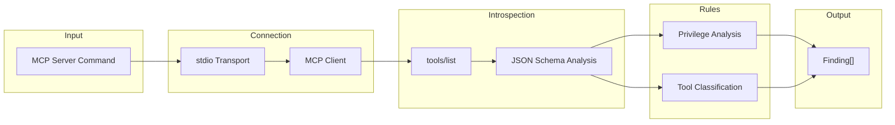

# MCPSentinel — AI Agent Audit Engine

MCPSentinel is Sentinel's engine for auditing **Model Context Protocol (MCP) servers** — the standard interface through which AI agents (like Claude, ChatGPT, or custom LLM agents) access external tools, databases, and APIs. MCPSentinel connects to your MCP server, introspects its tool schemas, and identifies excessive privileges and dangerous capabilities — **without ever executing the tools**.

## Why MCP Matters

Modern AI applications increasingly use MCP servers to give LLMs access to real-world capabilities: reading files, querying databases, sending emails, or deploying code. If these tools are misconfigured, an attacker can trick the LLM into performing destructive actions via **prompt injection**.

MCPSentinel ensures your MCP server follows the **Principle of Least Privilege**.

## How It Works

### Step-by-Step Scan Pipeline

1. **Server Launch:** MCPSentinel spawns the MCP server process using the provided command (e.g., `node server.js`) via `child_process.spawn()`.
2. **stdio Transport:** Communication happens over `stdin/stdout` using the JSON-RPC protocol defined by the MCP specification.
3. **Tool Enumeration:** MCPSentinel sends a `tools/list` request to enumerate all registered tools.
4. **Schema Analysis:** For each tool, it analyzes the tool name, description, and JSON Schema parameters.
5. **Rule Execution:** Security rules classify each tool and flag dangerous patterns.
6. **Clean Shutdown:** The MCP server process is gracefully terminated after introspection.

::: warning SAFETY GUARANTEE
MCPSentinel **never** sends `tools/call` requests. It only introspects schemas. This means your MCP server's tools are never executed during a Sentinel scan, eliminating the risk of side effects (like deleting files or sending emails).
:::

---

## Implemented Rules

### 1. Privilege Analysis (`mcp-privilege-analysis`)
- **Purpose:** Identifies tools with excessive or dangerous capabilities.
- **Detection Patterns:**
  - **Filesystem Access:** Tools with names or descriptions containing `file`, `read`, `write`, `delete`, `path`, `directory`.
  - **Database Access:** Tools containing `query`, `sql`, `database`, `table`, `insert`, `update`.
  - **Network Access:** Tools containing `http`, `fetch`, `request`, `curl`, `download`.
  - **Code Execution:** Tools containing `exec`, `eval`, `run`, `shell`, `command`, `spawn`.
  - **Destructive Operations:** Tools containing `delete`, `remove`, `drop`, `truncate`, `destroy`.
- **Severity:** HIGH (destructive) / MEDIUM (broad access)
- **Confidence:** HIGH

### 2. Tool Classification (`mcp-tool-classification`)
- **Purpose:** Categorizes each tool as `read-only`, `write`, or `destructive` based on its schema.
- **How:** Analyzes the tool name, description, and parameter schemas. Tools that only read data are classified as safe. Tools that modify or delete data are flagged.
- **Severity:** Informational
- **Confidence:** HIGH

---

## MCP Isolation

MCPSentinel enforces strict process isolation:
- The MCP server runs in a **separate child process** with no shared memory.
- Communication is limited to **stdin/stdout** JSON-RPC.
- A configurable **timeout** (default: 30 seconds) ensures the scan terminates even if the MCP server hangs.
- No environment variables from the parent process are leaked to the child process beyond what is explicitly configured.

---

## Cross-Engine Correlation

MCPSentinel's findings are correlated with CodeSentinel and WebSentinel by the Platform Orchestrator:

| MCPSentinel Finding | CodeSentinel Finding | WebSentinel Finding | Result |
| --- | --- | --- | --- |
| Tool has filesystem `delete` capability | Route `/api/chat` calls MCP client without auth | AI widget sends to `/api/chat` | 🚨 **P0 Attack Path** |
| Tool has database `query` capability | Route handler doesn't validate input | — | ⚠️ Elevated severity |
