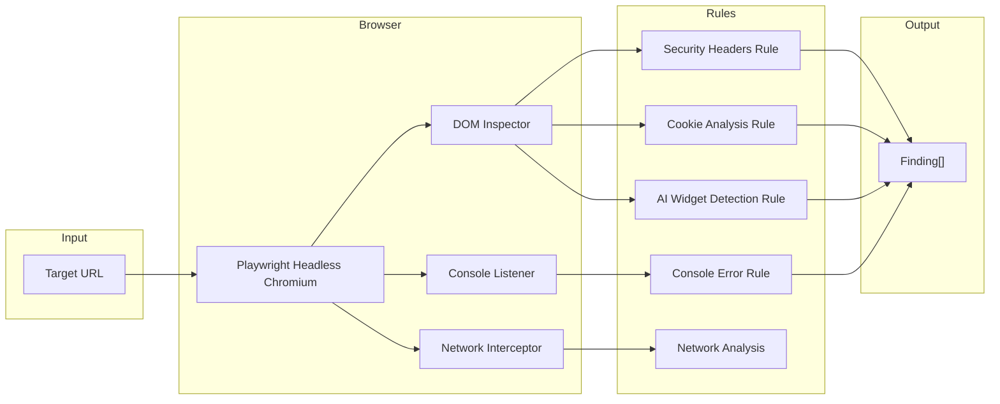

# WebSentinel — Dynamic Web Analysis Engine

WebSentinel is the dynamic analysis engine that crawls live web applications using a headless Chromium browser powered by [Playwright](https://playwright.dev/). It discovers security misconfigurations, AI chat widgets, missing headers, exposed cookies, and console errors — by actually visiting and interacting with your web application in real-time.

## How It Works



### Step-by-Step Scan Pipeline

1. **Target Validation:** WebSentinel validates the URL and enforces **SSRF Protection** — by default, `127.0.0.1`, `localhost`, `10.x.x.x`, `192.168.x.x`, and `169.254.x.x` are blocked unless the `--allow-local` flag is explicitly provided.
2. **Browser Launch:** A headless Chromium instance is launched via Playwright. Console messages and network requests are intercepted and recorded.
3. **Page Crawling:** The engine visits the target URL and discovers internal links (`<a href="...">`). It recursively crawls discovered pages up to a configurable depth (default: 2).
4. **Rule Execution:** On each page, all registered `WebRule` implementations run in parallel. Rules have access to the full Playwright `Page` object (DOM, network, console logs).
5. **AI Widget Fuzzing:** If an AI chat widget is detected (via heuristic DOM selectors like `[class*="chat"]`, `[class*="widget"]`, `[id*="assistant"]`), the engine:
   - Injects a tracking payload into the text input.
   - Clicks the submit button.
   - Intercepts the outgoing HTTP request to capture the exact network endpoint, method, and payload.
   - Optionally queries the local LLM for dynamically generated adversarial prompt-injection payloads.

---

## Implemented Rules

### 1. Security Headers (`web-security-headers`)
- **Purpose:** Validates that critical HTTP security headers are present.
- **Headers Checked:**
  - `Strict-Transport-Security` (HSTS)
  - `Content-Security-Policy` (CSP)
  - `X-Content-Type-Options`
  - `X-Frame-Options`
  - `X-XSS-Protection`
- **Severity:** HIGH
- **Confidence:** HIGH

### 2. Cookie Security (`web-cookie-security`)
- **Purpose:** Checks that cookies are set with secure attributes.
- **Attributes Validated:**
  - `Secure` flag (HTTPS-only transmission)
  - `HttpOnly` flag (prevents JavaScript access)
  - `SameSite` attribute (CSRF protection)
- **Severity:** HIGH (missing `HttpOnly`) / MEDIUM (missing `Secure`, `SameSite`)
- **Confidence:** HIGH

### 3. AI Chat Widget Detection (`web-ai-widget`)
- **Purpose:** Discovers AI-powered chat/support widgets in the DOM and probes them for prompt injection vulnerabilities.
- **Detection Heuristics:**
  - CSS selectors: `[class*="chat"]`, `[class*="widget"]`, `[id*="assistant"]`, `[data-widget]`
  - Input elements within widget containers
  - Submit buttons or send icons
- **Fuzzing Process:**
  1. Types a tracking payload (`Sentinel-Tracking-<UUID>`) into the input.
  2. Clicks the submit button.
  3. Captures the outgoing network request (URL, method, headers, body).
  4. Optionally generates LLM-crafted adversarial payloads (prompt injection, jailbreak attempts).
- **Severity:** MEDIUM (widget found) / HIGH (network endpoint captured)
- **Confidence:** HIGH

### 4. Console Errors (`web-console-errors`)
- **Purpose:** Captures JavaScript console errors and warnings emitted during page load.
- **Why It Matters:** Runtime errors can indicate broken API integrations, missing dependencies, or unhandled exceptions that attackers can exploit.
- **Severity:** LOW
- **Confidence:** HIGH

---

## SSRF Protection

WebSentinel implements strict Server-Side Request Forgery (SSRF) protection:

```typescript
const BLOCKED_RANGES = [
  /^127\./,          // Loopback
  /^10\./,           // Private Class A
  /^172\.(1[6-9]|2\d|3[01])\./, // Private Class B
  /^192\.168\./,     // Private Class C
  /^169\.254\./,     // Link-local
  /^0\./,            // Current network
  'localhost',
];
```

To scan a local development server, you **must** explicitly pass the `--allow-local` flag. This prevents Sentinel from being weaponized as an SSRF tool against internal infrastructure.

---

## Network Correlation

The network data captured by WebSentinel is critical for the Platform Orchestrator's **Tri-Boundary Correlation**. When WebSentinel captures an outgoing request from an AI widget to `POST /api/chat`, the Orchestrator can:
1. Check if CodeSentinel found that `/api/chat` route handler is missing authentication.
2. Check if MCPSentinel found that the MCP tool invoked by that route has destructive capabilities.
3. If all three match, emit a **P0 Attack Path** alert with zero false positives.
