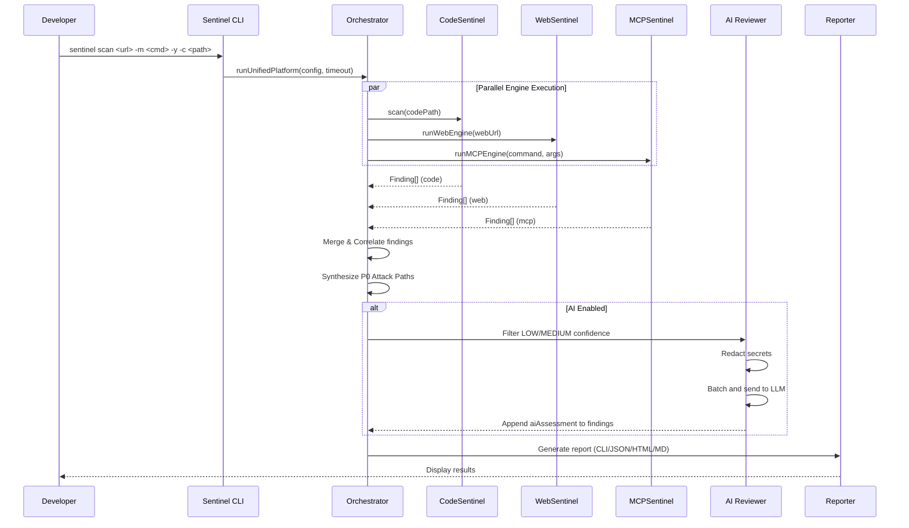

# Platform Orchestrator

The Platform Orchestrator is the central brain of Sentinel. It coordinates all three engines, manages their lifecycles, aggregates findings, runs AI triage, and produces the final reports.

## Scan Lifecycle



## Key Design Decisions

### 1. Parallel Execution with `Promise.allSettled()`
All three engines run concurrently. If one engine fails (e.g., MCP server won't start), the other two still produce results. The orchestrator handles partial failures gracefully.

### 2. Strict Authorization Gates
The orchestrator **refuses to execute** unless the user has explicitly confirmed authorization via `--authorized` (CLI) or the interactive wizard. This is enforced at the orchestrator level, not at the engine level.

### 3. Timeout Enforcement
Each engine has a configurable timeout (default: 30 seconds). If an engine exceeds the timeout, it is killed and its partial results are discarded. This prevents hung scans in CI/CD.

### 4. Score Calculation
The security score is calculated as `max(0, 100 - (criticals * 25) - (highs * 10) - (mediums * 3) - (lows * 1))`. A score of 0 means critical vulnerabilities were found. A score of 100 means the project is clean.

---

## Correlation Engine

The Correlation Engine is what makes Sentinel unique. After all three engines complete, it cross-references their findings to detect attack paths:

```typescript
// Pseudocode for P0 Attack Path detection
for (const webFinding of webFindings) {
  if (webFinding.ruleId === 'web-ai-widget' && webFinding.evidence.networkUrl) {
    const route = extractRoute(webFinding.evidence.networkUrl);
    
    const codeMatch = codeFindings.find(f =>
      f.ruleId === 'missing-auth' && f.location.includes(route)
    );
    
    const mcpMatch = mcpFindings.find(f =>
      f.ruleId === 'mcp-privilege-analysis' &&
      f.severity === 'HIGH'
    );
    
    if (codeMatch && mcpMatch) {
      emit({
        ruleId: 'platform-p0-attack-path',
        severity: 'CRITICAL',
        title: 'Zero-Day Attack Path Confirmed',
        message: `Widget → ${route} (no auth) → MCP tool (${mcpMatch.title})`
      });
    }
  }
}
```

## Reporters

| Reporter | Class | Output | Use Case |
| --- | --- | --- | --- |
| CLI | `CliReporter` | Colorized terminal output | Interactive development |
| JSON | `JsonReporter` | `UnifiedReport` JSON | API integrations, Jira |
| HTML | `HtmlReporter` | Styled HTML dashboard | Stakeholder sharing |
| Markdown | `MarkdownReporter` | GitHub-flavored Markdown | CI/CD PR comments |
| Executive | `ExecutiveReporter` | AI-generated HTML report | VC presentations |
