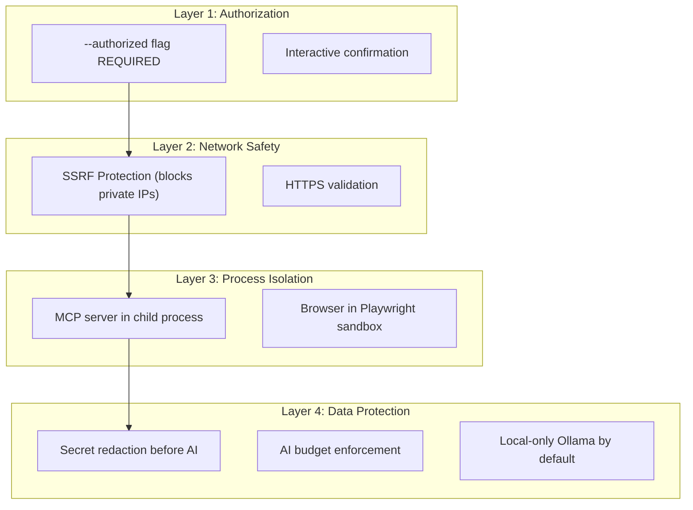

# Security Model

Sentinel is a security tool that scans potentially sensitive codebases and live systems. Its own security model is therefore critical.

## Design Principles

### 1. Source Code is the Source of Truth
Sentinel uses deterministic AST parsing, DOM inspection, and schema introspection. It does **not** rely on LLMs for primary vulnerability detection. AI is an optional enhancement layer that can be completely disabled.

### 2. Local-First Architecture
All analysis runs locally on the developer's machine. No source code, findings, or secrets are transmitted to external services unless the developer explicitly opts into the Gemini API.

### 3. Principle of Least Privilege
- CodeSentinel only **reads** source files. It never executes them.
- WebSentinel only **visits** web pages in a sandboxed Chromium browser. It cannot modify the target.
- MCPSentinel only **introspects** tool schemas. It never calls `tools/call`.

### 4. Defense in Depth

---

## SSRF Protection

WebSentinel blocks all requests to private/internal IP ranges by default:
- `127.0.0.0/8` (loopback)
- `10.0.0.0/8` (private class A)
- `172.16.0.0/12` (private class B)
- `192.168.0.0/16` (private class C)
- `169.254.0.0/16` (link-local)
- `localhost`

The `--allow-local` flag must be explicitly provided to scan local development servers. This prevents Sentinel from being weaponized as an SSRF attack tool against internal infrastructure.

---

## MCP Process Isolation

MCPSentinel enforces strict process isolation:
- The target MCP server runs in a **separate child process** via `child_process.spawn()`.
- Communication is limited to `stdin/stdout` JSON-RPC.
- A configurable timeout (default: 30s) kills the process if it hangs.
- MCPSentinel **never** sends `tools/call` — only `tools/list` for introspection.
- No environment variables from the parent process leak to the child.

---

## Authorization Model

Sentinel enforces a strict **double-gate** authorization model:

1. **CLI Gate:** The `--authorized` (`-y`) flag must be explicitly provided. Without it, the scan aborts immediately.
2. **Interactive Gate:** If using the wizard, the user must explicitly confirm they have legal authorization to test the targets.
3. **Timestamp Recording:** The authorization confirmation is recorded with an ISO-8601 timestamp in the config file for audit trail purposes.

---

## Secret Handling

### During Scanning
CodeSentinel detects hardcoded secrets in source code and reports them as `CRITICAL` findings. The secrets are included in the `evidence` field so developers can locate and remediate them.

### Before AI Processing
The `SecretRedactor` strips all sensitive patterns from finding evidence before sending to any LLM:
- AWS Access Keys (`AKIA...`)
- API Keys, tokens, passwords
- Connection strings
- Bearer tokens

### In Reports
Findings retain the original evidence (including secrets) in the local report. The developer is responsible for securing the report output.

---

## Threat Model

| Threat | Mitigation |
| --- | --- |
| Sentinel used to scan unauthorized targets | Authorization gates, timestamp recording |
| SSRF via WebSentinel | Private IP blocking, `--allow-local` opt-in |
| MCP server side effects during scan | Read-only introspection, no `tools/call` |
| Secrets leaked to AI providers | Secret redaction before LLM, local-first Ollama |
| AI hallucinating false vulnerabilities | AI findings are advisory only, never override deterministic results |
| Resource exhaustion on large projects | Max file count (5000), max file size (1MB), scan timeout |
| Malicious MCP server | Process isolation, timeout, no shared memory |
