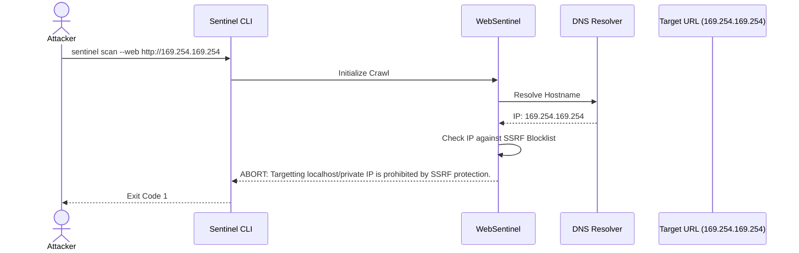
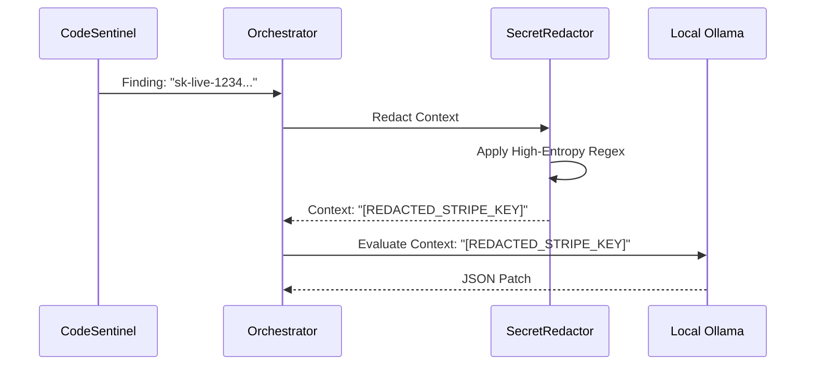

# Threat Model

Sentinel is designed to mitigate attacks against its own infrastructure while auditing untrusted targets.

## SSRF Mitigation Sequence
The following diagram illustrates how WebSentinel defends against a malicious user attempting to use the scanner to probe an internal cloud metadata endpoint.

## Secret Redaction Sequence
The following diagram illustrates how the `SecretRedactor` protects proprietary source code secrets from leaking to the LLM.

## Residual Risks

| Threat | Attack Surface | Mitigation | Residual Risk |
| --- | --- | --- | --- |
| **SSRF** | `--web` CLI argument | WebSentinel enforces strict IP blocklists. | High-entropy DNS rebinding attacks if the underlying OS resolver caches aggressively. |
| **RCE via Malicious MCP** | `--mcp` CLI argument | MCPSentinel only invokes `listTools`, and sandboxes the environment. | Target could still execute malicious payload upon startup (Node.js script execution). |
| **Secret Exfiltration** | `--ai` LLM Context | `SecretRedactor` masks high-entropy strings locally. | Unrecognized custom secret formats might leak to local Ollama logs. |
| **Malicious Code Execution** | `--code` CLI argument | CodeSentinel strictly parses ASTs and never uses `eval()` or requires the code. | None identified. |
